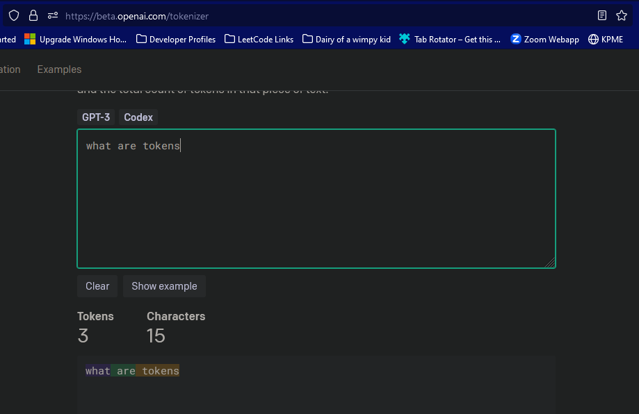
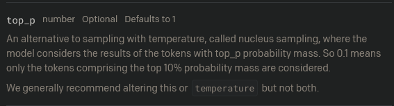

#### Notes

Parameters for request are :

- max_tokens - The maximum number of tokens to generate in the completion. Tokens are not just the number of words in the prompt, but a particular sequence which is commonly used.

- temperature - temperature is like a value for the model based on which it will decide whether if it needs to be creative or not. - [article link](https://towardsdatascience.com/how-to-sample-from-language-models-682bceb97277)
- top_p - of the generated tokens will filter and give according to top probability value.

- n - is the number of completions to generate for each prompt.

1. Even if temp was given 1, the suggestions were kinda weird, 0.9 suggestions had mixed languages. I think it was the use of top_p and temp. Need to figure out how to control those to produce desired results.

2. image generation was a bit confused about a few prompts, example i gave the prompt spongebob eating patrick and got the exact opposite, patrick with spongebob's hand in his mouth. Also, found out there's a safety check on the image generation as well. We cannot use it to generate celebrities images like "modi eating popcorn".

**We can train the model for prompts using a JSON document.**

